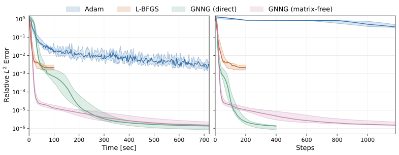
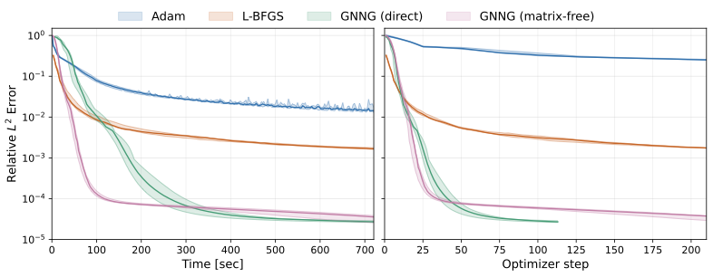

# Revisiting GNNG for PINNs

This repository contains the PyTorch implementation and experiments for the paper **Revisiting Gauss-Newton Natural Gradient Descent for Physics-Informed Neural Networks**.

The code compares two realizations of Gauss-Newton natural gradient descent (GNNG) for physics-informed neural networks:

- **chunked-direct GNNG**, which assembles the Gauss-Newton matrix from residual-Jacobian blocks and solves the resulting system directly;
- **matrix-free GNNG**, which applies the Gauss-Newton matrix through Jacobian-vector and vector-Jacobian products and solves the system by conjugate gradients.

The experiments use the steady two-dimensional Kovasznay flow and the unsteady three-dimensional Beltrami flow. Adam and L-BFGS are included as baseline optimizers.

All experiments were run on an NVIDIA GeForce RTX 4090 with 24 GB of VRAM.

## Repository Contents

```text
src/                 implementation of models, residuals, optimizers, and utilities
notebooks/           train the models and generate results
runs/                outputs of the recorded experiments used for the figures and tables
docs/                generated figures and LaTeX table rows
envs/gnng-lab.yml    Micromamba environment file
pyproject.toml       editable Python package configuration
```

The accompanying paper is not included in this public repository.

## Results at a Glance

The main experiments compare Adam, L-BFGS, chunked-direct GNNG, and matrix-free GNNG under the same 12-minute wall-clock budget.





On both benchmarks, the GNNG variants reach substantially lower relative `L2` errors than Adam and L-BFGS. The recorded runs also include the ablations used in the accompanying paper.

## Setup

Create and activate the environment:

```bash
micromamba env create -f envs/gnng-lab.yml
micromamba activate gnng-lab
```

Install PyTorch. The reported experiments were run with PyTorch `2.11.0+cu128`:

```bash
pip install torch==2.11.0 --index-url https://download.pytorch.org/whl/cu128
```

Install this repository in editable mode:

```bash
pip install -e .
```

For deterministic PyTorch behavior on CUDA, set this before starting Python or Jupyter:

```bash
export CUBLAS_WORKSPACE_CONFIG=:4096:8
```

## Reproducing the Figures and Tables

The reported run outputs are included under `runs/`. To regenerate the figures and LaTeX table rows from these recorded runs, execute:

```text
notebooks/kovasznay_results.ipynb
notebooks/beltrami_results.ipynb
```

These notebooks write figures to `docs/figures/` and LaTeX table rows to `docs/tables/`. They point to the recorded sweeps used for the figures above:

```text
runs/kovasznay/sweep_20260421-083905_v6_rtx4090
runs/beltrami/sweep_20260505-072724_v1_rtx4090
```

To rerun the training experiments, execute:

```text
notebooks/kovasznay_train.ipynb
notebooks/beltrami_train.ipynb
```

Running a training notebook creates a new timestamped sweep directory under `runs/kovasznay/` or `runs/beltrami/`. To generate figures and table rows from a new sweep, open the corresponding result notebook and set `SWEEP_NAME` near the top of the notebook to the new sweep directory name. The result notebooks then regenerate the figures in `docs/figures/` and the LaTeX table rows in `docs/tables/`.


## Notes on the Implementation

The implementation uses fixed collocation sets and double precision. For efficient residual evaluation, the code includes structured propagation of first- and second-order input derivatives through the neural network. This avoids repeatedly constructing expensive automatic-differentiation graphs for the spatial derivatives.

Both variants use a simple adaptive damping factor to regularize the Gauss-Newton system. The matrix-free GNNG variant also uses a preconditioner based on a reduced collocation set for the iterative conjugate gradient (CG) method.